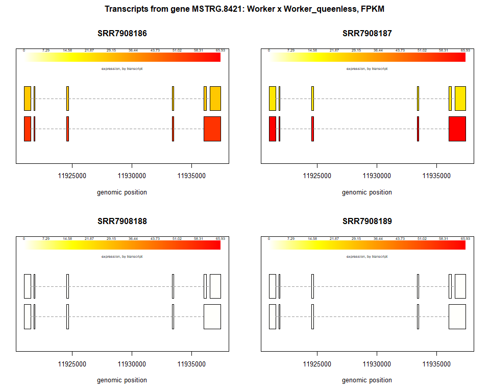
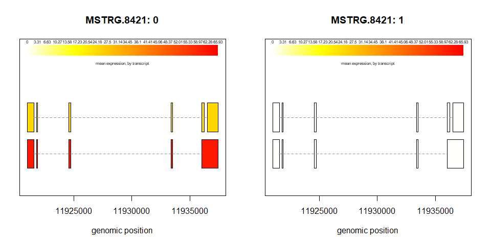

Differencial expression of a long non coding RNA with ballgown
================
Luiz Carlos Vieira
18/02/2022

# Ballgown

Ballgown is a software package designed to facilitate flexible
differential expression analysis of RNA-seq data.

## Data description

As input data we use the table counts for Ballgown provenient from stringtie.
``` r
data_description = read.table("pheno_data.txt", header = TRUE, sep = "\t")
data_description
```

    ##    sample_id group      description
    ## 1 SRR7908186    w1           worker
    ## 2 SRR7908187    w2           worker
    ## 3 SRR7908188   aw1 worker_queenless
    ## 4 SRR7908189   aw2 worker_queenless
    ## 5 SRR7908190    q1            queen
    ## 6 SRR7908191    q2            queen

## Libraries
``` r
library(ballgown)
library(genefilter)
library(dplyr)
library(xlsx)
```

## Loading data for camparation queen x workers queenless

Making the ballgown object:
``` r
bg1 = ballgown(dataDir="ballgown1", samplePattern='SRR', meas='all')
bg2 = ballgown(dataDir="ballgown2", samplePattern='SRR', meas='all')
```

The data in the pData has to be in the same order as the samples in bg object
``` r
sampleNames(bg1)
```

    ## [1] "SRR7908186" "SRR7908187" "SRR7908188" "SRR7908189"

``` r
sampleNames(bg2)
```

    ## [1] "SRR7908186" "SRR7908187" "SRR7908190" "SRR7908191"

## Creating a pheno data, with the sample names as bg object
``` r
pheno_data1 = read.table("ballgown1/pheno_data.txt", header = TRUE, sep = "\t")
pheno_data2 = read.table("ballgown2/pheno_data.txt", header = TRUE, sep = "\t")
```


## Loading pData into the objet bg
``` r
pData(bg1) <- pheno_data1
pData(bg2) <- pheno_data2
```

## Filter to remove low-abundance genes.

One common issue with RNA-seq data is that genes often have very few or
zero counts.

Removing all transcripts with a variance across samples lessvthan one:

``` r
bg1 = subset(bg1,"rowVars(texpr(bg1)) > 10", genomesubset=TRUE)
bg2 = subset(bg2,"rowVars(texpr(bg2)) > 10", genomesubset=TRUE)
```

## Accessing expression data

A ballgown object has six slots: structure, expr, indexes, dirs,
mergedDate, and meas.

The expr slot is a list that contains tables of expression data for the
genomic features.

Ballgown implements the following syntax to access components of the
expr slot:

e for exon, i for intron, t for transcript, g for gene,
``` r
trans_expression1 = texpr(bg1, 'all')
trans_expression2 = texpr(bg2, 'all')

gene_expression1 = as.data.frame(gexpr(bg1))
gene_expression2 = as.data.frame(gexpr(bg2))
```

## Finding expressiong of genes of interest

``` r
genes_of_interest = c("MSTRG.8421", "LOC726407")

filter(gene_expression1, row.names(gene_expression1) == genes_of_interest)
```

    ## [1] FPKM.SRR7908186 FPKM.SRR7908187 FPKM.SRR7908188 FPKM.SRR7908189
    ## <0 linhas> (ou row.names de comprimento 0)

``` r
filter(gene_expression2, row.names(gene_expression2) == genes_of_interest)
```

    ##            FPKM.SRR7908186 FPKM.SRR7908187 FPKM.SRR7908190 FPKM.SRR7908191
    ## MSTRG.8421        79.92598        85.50492               0               0


## Creating a list os transcript of interest

``` r
tx_of_interest <- c("transcript:XM_001120691", "transcript:XM_006566320", "transcript:XM_006566319", "transcript:XM_393800", "MSTRG.8421.2", "MSTRG.8421.3")

dplyr::filter(trans_expression1, t_name %in% tx_of_interest)
```

    ##    t_id        chr strand    start      end       t_name num_exons length
    ## 1 28947 CM009941.2      - 11920971 11937453 MSTRG.8421.2         5   2398
    ## 2 28948 CM009941.2      - 11920974 11937453 MSTRG.8421.3         6   2121
    ##      gene_id gene_name cov.SRR7908186 FPKM.SRR7908186 cov.SRR7908187
    ## 1 MSTRG.8421         .      18.371180        56.03842      21.423826
    ## 2 MSTRG.8421         .       8.853835        27.00724       6.842244
    ##   FPKM.SRR7908187 cov.SRR7908188 FPKM.SRR7908188 cov.SRR7908189 FPKM.SRR7908189
    ## 1        66.67136              0               0              0               0
    ## 2        21.29320              0               0              0               0

# Visualization data distribuition

Visualization of the assembled transcripts is done with the
plotTranscripts function.

Transcripts or exons are colored by expression level, (in this case,
transcripts expression level):

## Worker x Worker\_queenless

get the sample names

``` r
sampleNames(bg1)
```

    ## [1] "SRR7908186" "SRR7908187" "SRR7908188" "SRR7908189"

Transcripts expression level

``` r
plotTranscripts(gene='MSTRG.8421', gown=bg1, samples=c("SRR7908186", "SRR7908187", "SRR7908188", "SRR7908189"),
                meas='FPKM', colorby='transcript', main='Transcripts from gene MSTRG.8421: Worker x Worker_queenless, FPKM')
```

<!-- -->

## Worker x Queen

get the sample names

``` r
sampleNames(bg2)
```

    ## [1] "SRR7908186" "SRR7908187" "SRR7908190" "SRR7908191"

Transcripts expression level

``` r
plotTranscripts(gene='MSTRG.8421', gown=bg2, samples=c("SRR7908186", "SRR7908187", "SRR7908190", "SRR7908191"),
                meas='FPKM', colorby='transcript', main='Transcripts from gene MSTRG.8421: Worker x Worker_queenless, FPKM')
```

<!-- -->

## Side-by-side plots comparing mean abundances between groups (here, 0 and 1):

### worker x worker\_queenless
``` r
plotMeans('MSTRG.8421', bg1, groupvar='condition', meas='FPKM', colorby='transcript')
```

<!-- -->

### worker x queen
``` r
plotMeans('MSTRG.8421', bg2, groupvar='condition', meas='FPKM', colorby='transcript')
```

<!-- -->

## statistical results for transcripts:

### Transcripts bg1
``` r
results_transcripts1 = stattest(bg1, feature="transcript", covariate="condition", getFC=TRUE, meas="FPKM")

# Add gene names and gene IDs to the results_transcripts data frame:
results_transcripts1 = data.frame(geneNames=ballgown::geneNames(bg1), geneIDs=ballgown::geneIDs(bg1), results_transcripts1)

# Sort the results from the smallest P value to the largest:
results_transcripts1 = arrange(results_transcripts1, pval)

head(results_transcripts1)
```

    ##       geneNames    geneIDs    feature    id           fc         pval      qval
    ## 4349          . MSTRG.1273 transcript  4349 5.522639e-08 3.904127e-05 0.4207087
    ## 6718          . MSTRG.1952 transcript  6718 3.091028e-10 2.341900e-04 0.7511686
    ## 26526         . MSTRG.7696 transcript 26526 1.789784e-01 3.301192e-04 0.7511686
    ## 2952          .  MSTRG.890 transcript  2952 3.995108e-02 3.375843e-04 0.7511686
    ## 30960         . MSTRG.8975 transcript 30960 3.958236e-03 4.934379e-04 0.7511686
    ## 1362          .  MSTRG.463 transcript  1362 4.435621e+01 5.625522e-04 0.7511686

### Transcripts bg2
``` r
results_transcripts2 = stattest(bg2, feature="transcript", covariate="condition", getFC=TRUE, meas="FPKM")

#Add gene names and gene IDs to the results_transcripts data frame:
results_transcripts2 = data.frame(geneNames=ballgown::geneNames(bg2), geneIDs=ballgown::geneIDs(bg2), results_transcripts2)

#Sort the results from the smallest P value to the largest:
results_transcripts2 = arrange(results_transcripts2, pval)

head(results_transcripts2)
```

    ##       geneNames    geneIDs    feature    id           fc         pval      qval
    ## 9159          . MSTRG.2592 transcript  9159 3.194516e-02 0.0002436353 0.3756646
    ## 2952          .  MSTRG.890 transcript  2952 3.966152e-02 0.0003561382 0.3756646
    ## 6683          . MSTRG.1975 transcript  6683 3.584916e-30 0.0004554406 0.3756646
    ## 11002         . MSTRG.3132 transcript 11002 2.794172e-02 0.0006258473 0.3756646
    ## 22521         . MSTRG.6579 transcript 22521 7.150017e-03 0.0006623418 0.3756646
    ## 15682         . MSTRG.4490 transcript 15682 5.732909e-52 0.0010216044 0.3756646


## Statistical results at gene level:

### Genes bg1
``` r
results_genes1 = stattest(bg1, feature="gene", covariate="condition", getFC=TRUE, meas="FPKM")

# Sort the results from the smallest P value to the largest:
results_genes1 = arrange(results_genes1, pval)
```

### genes bg2
``` r
results_genes2 = stattest(bg2, feature="gene", covariate="condition", getFC=TRUE, meas="FPKM")

#Sort the results from the smallest P value to the largest:
results_genes2 = arrange(results_genes2, pval)
```

## Saving the files
``` r
# expression table of transcripts
#writexl::write_xlsx(trans_expression1, "transcript_table_W_x_aW.xlsx")
#writexl::write_xlsx(trans_expression2, "transcript_table_W_x_Q.xlsx")
#writexl::write_xlsx(trans_expression3, "transcript_table_aW_x_Q.xlsx")

# statistic results of transcripts
#writexl::write_xlsx(results_transcripts1, "transcript_stats_W_x_aW.xlsx")
#writexl::write_xlsx(results_transcripts2, "transcript_stats_W_x_Q.xlsx")
#writexl::write_xlsx(results_transcripts3, "transcript_stats_aW_x_Q.xlsx")
```

## SessionInfo
    ## R version 4.1.2 (2021-11-01)
    ## Platform: x86_64-w64-mingw32/x64 (64-bit)
    ## Running under: Windows 10 x64 (build 22000)
    ## 
    ## Matrix products: default
    ## 
    ## locale:
    ## [1] LC_COLLATE=Portuguese_Brazil.1252  LC_CTYPE=Portuguese_Brazil.1252   
    ## [3] LC_MONETARY=Portuguese_Brazil.1252 LC_NUMERIC=C                      
    ## [5] LC_TIME=Portuguese_Brazil.1252    
    ## 
    ## attached base packages:
    ## [1] stats     graphics  grDevices utils     datasets  methods   base     
    ## 
    ## other attached packages:
    ## [1] xlsx_0.6.5        dplyr_1.0.8       genefilter_1.76.0 ballgown_2.26.0  
    ## 
    ## loaded via a namespace (and not attached):
    ##  [1] MatrixGenerics_1.6.0        Biobase_2.54.0             
    ##  [3] httr_1.4.2                  edgeR_3.36.0               
    ##  [5] bit64_4.0.5                 splines_4.1.2              
    ##  [7] assertthat_0.2.1            highr_0.9                  
    ##  [9] stats4_4.1.2                xlsxjars_0.6.1             
    ## [11] blob_1.2.2                  GenomeInfoDbData_1.2.7     
    ## [13] Rsamtools_2.10.0            yaml_2.3.5                 
    ## [15] pillar_1.7.0                RSQLite_2.2.10             
    ## [17] lattice_0.20-45             glue_1.6.2                 
    ## [19] limma_3.50.1                digest_0.6.29              
    ## [21] GenomicRanges_1.46.1        RColorBrewer_1.1-2         
    ## [23] XVector_0.34.0              htmltools_0.5.2            
    ## [25] Matrix_1.4-0                pkgconfig_2.0.3            
    ## [27] XML_3.99-0.9                zlibbioc_1.40.0            
    ## [29] purrr_0.3.4                 xtable_1.8-4               
    ## [31] BiocParallel_1.28.3         tibble_3.1.6               
    ## [33] annotate_1.72.0             KEGGREST_1.34.0            
    ## [35] mgcv_1.8-39                 generics_0.1.2             
    ## [37] IRanges_2.28.0              ellipsis_0.3.2             
    ## [39] cachem_1.0.6                SummarizedExperiment_1.24.0
    ## [41] BiocGenerics_0.40.0         cli_3.2.0                  
    ## [43] survival_3.3-1              magrittr_2.0.2             
    ## [45] crayon_1.5.0                memoise_2.0.1              
    ## [47] evaluate_0.15               fansi_1.0.2                
    ## [49] nlme_3.1-155                tools_4.1.2                
    ## [51] BiocIO_1.4.0                lifecycle_1.0.1            
    ## [53] matrixStats_0.61.0          stringr_1.4.0              
    ## [55] S4Vectors_0.32.3            locfit_1.5-9.5             
    ## [57] DelayedArray_0.20.0         AnnotationDbi_1.56.2       
    ## [59] Biostrings_2.62.0           compiler_4.1.2             
    ## [61] GenomeInfoDb_1.30.1         rlang_1.0.2                
    ## [63] grid_4.1.2                  RCurl_1.98-1.6             
    ## [65] rstudioapi_0.13             rjson_0.2.21               
    ## [67] bitops_1.0-7                rmarkdown_2.13             
    ## [69] restfulr_0.0.13             DBI_1.1.2                  
    ## [71] R6_2.5.1                    GenomicAlignments_1.30.0   
    ## [73] knitr_1.37                  rtracklayer_1.54.0         
    ## [75] utf8_1.2.2                  fastmap_1.1.0              
    ## [77] bit_4.0.4                   rJava_1.0-6                
    ## [79] stringi_1.7.6               parallel_4.1.2             
    ## [81] sva_3.42.0                  Rcpp_1.0.8                 
    ## [83] vctrs_0.3.8                 png_0.1-7                  
    ## [85] tidyselect_1.1.2            xfun_0.30

## References

<https://www.ncbi.nlm.nih.gov/pmc/articles/PMC5032908/>  

<https://bioconductor.riken.jp/packages/3.7/bioc/vignettes/ballgown/inst/doc/ballgown.html>  
