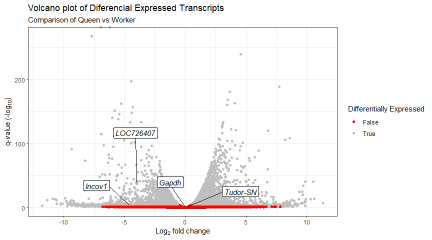
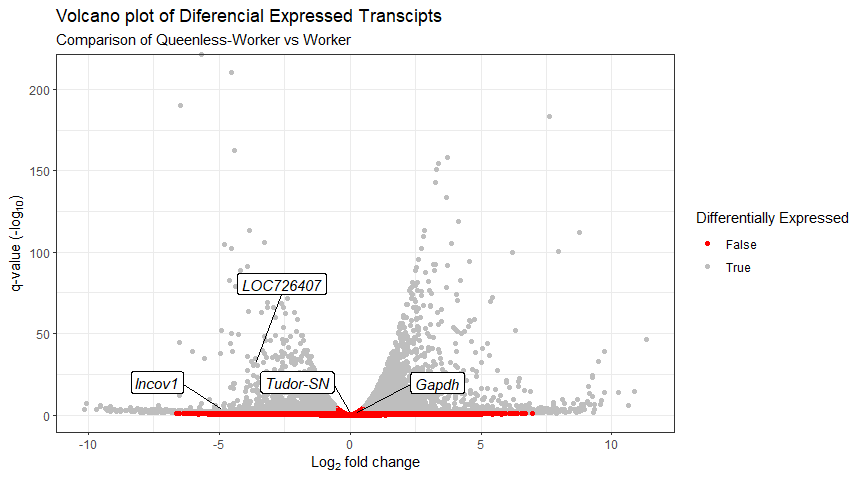
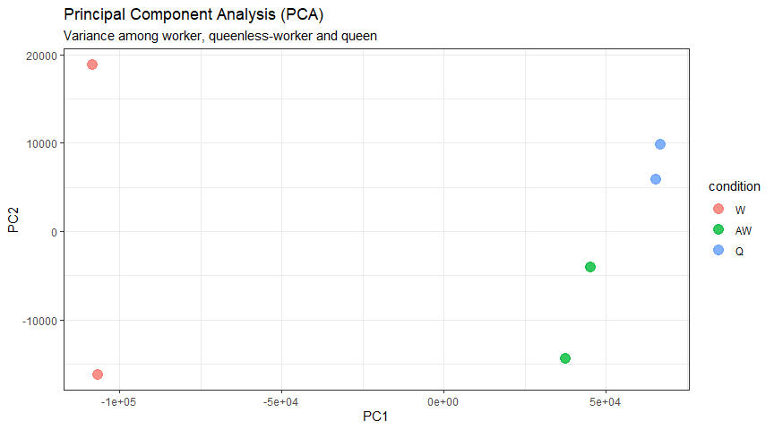
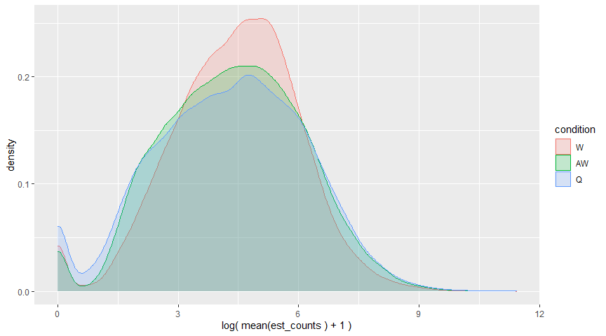
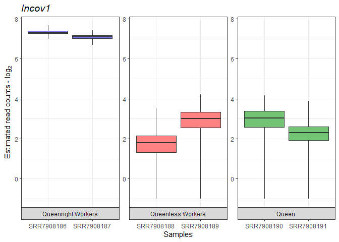
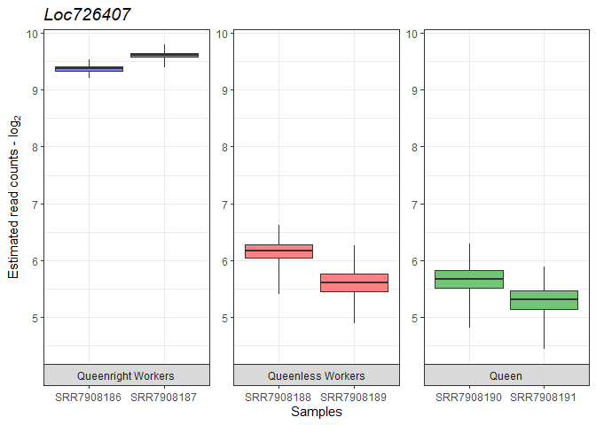
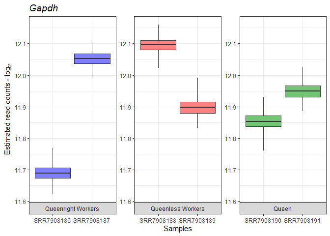
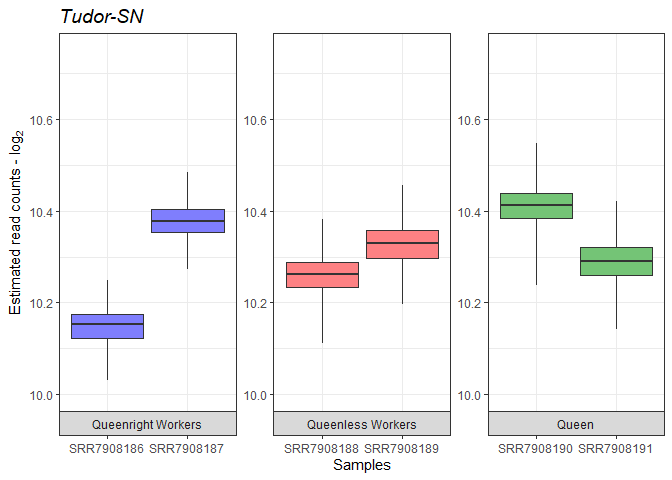
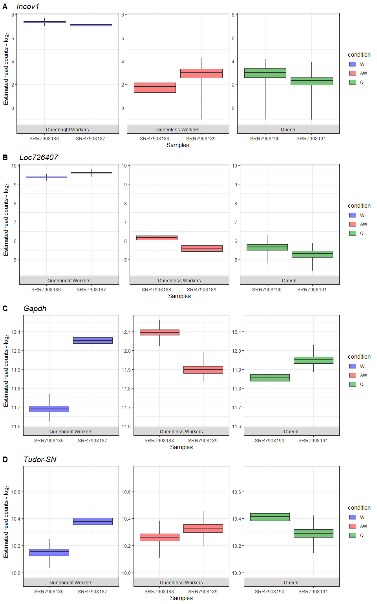

Diferencial Expression with Sleuth
================
Luiz Carlos Vieira
23/03/2022

# Sleuth for estimation of differential expression of transcripts

Sleuth is a program for differential analysis of RNA-Seq data. It makes
use of quantification uncertainty estimates obtained via kallisto for
accurate differential analysis of isoforms or genes, allows testing in
the context of experiments with complex designs, and supports
interactive exploratory data analysis via sleuth live.

The sleuth methods are described in:

H Pimentel, NL Bray, S Puente, P Melsted and Lior Pachter, Differential
analysis of RNA-seq incorporating quantification uncertainty, Nature
Methods (2017), advanced access.

## Instalation of leuth

``` r
#BiocManager::install("pachterlab/sleuth")
```

I got an ERRO:

namespace:rhdf5’ Execution halted ERROR: lazy loading failed for package
‘sleuth’

removing ‘C:/Users/31625/Documents/R/win-library/4.1/sleuth’

## Working around

-   Run git clone <https://github.com/pachterlab/sleuth>

-   Remove the last line in ./sleuth/NAMESPACE file which is the
    h5write.default that raises the error during installation - ignore
    the warning in the first line

-   Then in R: make sure to set work env in R env to the same local
    where git was cloned.

``` r
# setwd("C:/Users/username/Downloads")
# devtools::install('./sleuth/')
```

## Loading libraries

## Get help

``` r
#vignette('intro', package = 'sleuth')
```

# Sleuth for estimation of differential expression of transcripts

The workflow for Sleuth is similar to the workflow followed for DESeq2,
even though, the models for estimating differential expression are very
different.

-   Step 1: Creation of Sleuth object to provide metadata, estimated
    counts, and design formula for the analysis, in addition to a
    annotables database to switch between transcript IDs and associated
    gene names.

-   Step 2: Fit the sleuth model

Estimation of size (normalization) factors using the median of ratios
method (similar to DESeq2)

Normalization of estimated counts using size factors (est. counts / size
factors - similar to DESeq2)

Filtering of low abundance transcripts (&lt; 5 est counts in more than
47% of the samples)

Normalization of technical variation estimates

Estimation of biological variance and shrinkage estimates (With small
sample sizes, we will make very bad estimates of transcript-wise
dispersion unless we share information across transcripts. Sleuth
regularizes the biological variance estimate with shrinkage, similar to
DESeq2.

Parameter estimation and estimation of variance using the general linear
model.

Identification of:

Coefficients: indicating overall expression strength Beta values:
estimates of fold changes

-   Step 3: Test for significant differences between conditions

## Step 1: Create Sleuth object for analysis

Similar to DESeq2, we need to tell Sleuth where to find the metadata
(specifying which sample groups the samples belong to, and any other
metadata we want included in the analysis), estimated counts (output
from kallisto) and the design formula.

To create this Sleuth object, we need to perform the following steps:

Create a dataframe containing metadata and locations of the estimated
counts files:

-   a column named sample containing all of the sample names matching
    the names in the metadata file.
-   a column named condition containing the groups of study like
    treatment and control.
-   a column named path containing the path to the abundance estimate
    files output from kallisto.

## Creating a metadata dataframe

Create metadata associated with the kallisto files as in the DESeq2
using the data.frame().

``` r
base_dir <- "C:/Users/luiz_/OneDrive/Analysis/transcriptome_Analysis_Carlos/GSE120561/kallisto"

sample_id <- dir(file.path(base_dir))


# Sleuth requires a column entitled “sample” containing the sample names:
metadata <- data.frame(sample = sample_id,
                          condition = factor(c(rep("W", 2),
                                               rep("AW", 2),
                                               rep("Q", 2))))
```

## Creating a list of the paths to our transcript abundance files:

First, we create a simple vector containing the paths to the directories
containing the transcript abundance estimates for each sample (folders
containing the .quant files).

``` r
# file.path() function gives the paths to each of the directories.
paths <- file.path(base_dir, sample_id)

paths
```

    ## [1] "C:/Users/luiz_/OneDrive/Analysis/transcriptome_Analysis_Carlos/GSE120561/kallisto/SRR7908186"
    ## [2] "C:/Users/luiz_/OneDrive/Analysis/transcriptome_Analysis_Carlos/GSE120561/kallisto/SRR7908187"
    ## [3] "C:/Users/luiz_/OneDrive/Analysis/transcriptome_Analysis_Carlos/GSE120561/kallisto/SRR7908188"
    ## [4] "C:/Users/luiz_/OneDrive/Analysis/transcriptome_Analysis_Carlos/GSE120561/kallisto/SRR7908189"
    ## [5] "C:/Users/luiz_/OneDrive/Analysis/transcriptome_Analysis_Carlos/GSE120561/kallisto/SRR7908190"
    ## [6] "C:/Users/luiz_/OneDrive/Analysis/transcriptome_Analysis_Carlos/GSE120561/kallisto/SRR7908191"

### Naming the vector of directory paths with the corresponding sample names

``` r
# Name the directory paths for the abundance files with their corresponding sample IDs
names(paths) <- sample_id

paths
```

    ##                                                                                     SRR7908186 
    ## "C:/Users/luiz_/OneDrive/Analysis/transcriptome_Analysis_Carlos/GSE120561/kallisto/SRR7908186" 
    ##                                                                                     SRR7908187 
    ## "C:/Users/luiz_/OneDrive/Analysis/transcriptome_Analysis_Carlos/GSE120561/kallisto/SRR7908187" 
    ##                                                                                     SRR7908188 
    ## "C:/Users/luiz_/OneDrive/Analysis/transcriptome_Analysis_Carlos/GSE120561/kallisto/SRR7908188" 
    ##                                                                                     SRR7908189 
    ## "C:/Users/luiz_/OneDrive/Analysis/transcriptome_Analysis_Carlos/GSE120561/kallisto/SRR7908189" 
    ##                                                                                     SRR7908190 
    ## "C:/Users/luiz_/OneDrive/Analysis/transcriptome_Analysis_Carlos/GSE120561/kallisto/SRR7908190" 
    ##                                                                                     SRR7908191 
    ## "C:/Users/luiz_/OneDrive/Analysis/transcriptome_Analysis_Carlos/GSE120561/kallisto/SRR7908191"

### Combining the metadata with the paths

Combining the metadata with the paths to the transcript abundance files
to use as input for the Sleuth analysis.

Sleuth requires a column entitled “path” containing the paths to the
estimated counts files stored in our sf\_dirs:

``` r
# Adding a column named 'path'
metadata$path <- paths

metadata
```

    ##       sample condition
    ## 1 SRR7908186         W
    ## 2 SRR7908187         W
    ## 3 SRR7908188        AW
    ## 4 SRR7908189        AW
    ## 5 SRR7908190         Q
    ## 6 SRR7908191         Q
    ##                                                                                           path
    ## 1 C:/Users/luiz_/OneDrive/Analysis/transcriptome_Analysis_Carlos/GSE120561/kallisto/SRR7908186
    ## 2 C:/Users/luiz_/OneDrive/Analysis/transcriptome_Analysis_Carlos/GSE120561/kallisto/SRR7908187
    ## 3 C:/Users/luiz_/OneDrive/Analysis/transcriptome_Analysis_Carlos/GSE120561/kallisto/SRR7908188
    ## 4 C:/Users/luiz_/OneDrive/Analysis/transcriptome_Analysis_Carlos/GSE120561/kallisto/SRR7908189
    ## 5 C:/Users/luiz_/OneDrive/Analysis/transcriptome_Analysis_Carlos/GSE120561/kallisto/SRR7908190
    ## 6 C:/Users/luiz_/OneDrive/Analysis/transcriptome_Analysis_Carlos/GSE120561/kallisto/SRR7908191

### Defining condition levels

NOTE: Sleuth will automatically use the first level (alphabetically by
default) in the factor variable being tested to compare all other
conditions against (in the metadata, this is ‘AW’, but in other cases
like: control vs treated, coltrol will be used as first level).

If you want to use a different condition to be the base level, then you
would need to use the relevel() function to change the base level of the
variable.

For example, if we wanted the base level of condition to be “W”, we
could use the following code:

``` r
metadata$condition <- relevel(metadata$condition, ref = "W")
```

### Creating a variable containing the model design

With the metadata and location of the count estimates, we can input our
design formula to determine the covariates and/or confounders that
should be included in your experimental design model.

Sleuth can be used to analyze multiple conditions from complex
experimental designs. Within Sleuth, models are written similar to
DESeq2.

``` r
design <- ~ condition
```

## Step 2: Fit the sleuth model

Fit the transcript abundance data to the Sleuth model Using the
sleuth\_prep() function, the counts are normalized and filtered, then
merged with the metadata. In addition, the bootstraps for each
transcript are summarized.

This function can take a bit of time, but there is an option (ncores) to
split across multiple processors.

``` r
so <- sleuth_prep(metadata, 
                  full_model = design, 
                  #target_mapping = t2g,
                  num_cores = 4L,
                  read_bootstrap_tpm = TRUE,
                  extra_bootstrap_summary = TRUE,
                  transform_fun_counts = function(x) log2(x + 0.5)
                  )
```

    ## Warning in check_num_cores(num_cores): It appears that you are running Sleuth from within Rstudio.
    ## Because of concerns with forking processes from a GUI, 'num_cores' is being set to 1.
    ## If you wish to take advantage of multiple cores, please consider running sleuth from the command line.

    ## reading in kallisto results

    ## dropping unused factor levels

    ## ......
    ## normalizing est_counts
    ## 17599 targets passed the filter
    ## normalizing tpm
    ## merging in metadata
    ## summarizing bootstraps
    ## ......

NOTE: By default the transformation of counts is natural log, which
would make the output fold changes somewhat more difficult to interpret.
By specifying the transform\_fun\_counts to be log2(x + 0.5) we are
ensuring our output fold changes are log2.

offset = 0.5 is need to to prevent taking the log of 0.

### Fitting the sleuth model

sleuth performs shrinkage of variance, parameter estimation and
estimation of variance using the general linear model:

``` r
so <- sleuth_fit(so)
```

    ## fitting measurement error models

    ## shrinkage estimation

    ## computing variance of betas

### Check which models have been fit and which coefficients can be tested

Ensure the design model and coefficients are correct for your analysis.

The level not shown is the base level.

``` r
models(so)
```

    ## [  full  ]
    ## formula:  ~condition 
    ## data modeled:  obs_counts 
    ## transform sync'ed:  TRUE 
    ## coefficients:
    ##  (Intercept)
    ##      conditionAW
    ##      conditionQ

## Step 3: Test significant differences between conditions using the Wald test

At this step in the workflow, we need to specify which level we want to
compare against the base level (use the name given for the coefficients
from models(so)):

### Wald test for differential expression of isoforms

``` r
DE_AW <- sleuth_wt(so, which_beta = 'conditionAW')


DE_Q <- sleuth_wt(so, which_beta = 'conditionQ')


# Get results
sleuth_results_AW <- sleuth_results(DE_AW, 
                                    test = 'conditionAW', 
                                    show_all = TRUE)

sleuth_results_Q <- sleuth_results(DE_Q, 
                                    test = 'conditionQ', 
                                    show_all = TRUE)
```

NOTE: The output represents the results from the differential expression
testing with the following columns:

-   target\_id: the Ensembl transcript ID
-   pval: the Wald test FDR adjusted pvalue using Benjamini-Hochberg
-   qval: the p-value adjusted for multiple test correction
-   b: beta value, which is the log2 fold changes between conditions
    (These are log2 b/c we specified log2 transformation in the
    sleuth\_prep() step. By default, these would have been natural log
    fold changes).
-   se\_b: standard error of the beta value
-   mean\_obs: the mean expression (log2) of the transcript across all
    samples
-   var\_obs: the biological variance of the expression
-   tech\_var: the technical variance of expression (derived from the
    bootstraps)
-   sigma\_sq: raw estimator of the variance once the technical variance
    has been removed
-   smooth\_sigma\_sq: the smooth regression fit for the shrinkage
    estimation
-   final\_sigma\_sq: max(sigma\_sq, smooth\_sigma\_sq). this is the one
    used for covariance estimation of beta (in addition to tech\_var)
-   ens\_gene: associated Ensembl gene ID
-   ext\_gene: associated gene symbol

## Salving results table

``` r
#write.xlsx(sleuth_results_AW, file='results/sleuth_results_AW.xlsx', sheetName = "DE_AW", 
#  col.names = TRUE, row.names = FALSE, append = FALSE)
#
#write.xlsx(sleuth_results_Q, file='results/sleuth_results_Q.xlsx', sheetName = "DE_Q", 
#  col.names = TRUE, row.names = FALSE, append = FALSE)
```

## Visualization of resultus with shiny app.

``` r
#sleuth_live(so)
```

# ——————————————————————————–

# Results and visualization

# ——————————————————————————–

List of transcrits of interest: “XM\_001120691.5”, “XM\_393605.7”,
“XM\_624635.6”, “lncov1”

``` r
txI <- c("XM_001120691.5", "XM_393605.7", "XM_624635.6", "lncov1") 
```

## Get Differencial expressed transcripts results table

``` r
sleuth_sig_AW <- dplyr::filter(sleuth_results_AW, pval <= 0.05)
sleuth_sig_Q <- dplyr::filter(sleuth_results_Q, pval <= 0.05)

head(sleuth_sig_AW)
```

    ##        target_id          pval          qval         b      se_b  mean_obs
    ## 1 XM_001120991.5  0.000000e+00  0.000000e+00 -5.666737 0.1399872 10.047758
    ## 2 XM_026440745.1 2.611400e-211 2.297902e-207 -4.523997 0.1458256  9.859082
    ## 3    XM_392190.7 4.276566e-191 2.508776e-187 -6.459788 0.2190754  9.805255
    ## 4 XM_003250895.4 3.014828e-184 1.326449e-180  7.613183 0.2629994  8.950848
    ## 5 XM_001122993.5 2.111095e-163 7.430632e-160 -4.420064 0.1622564  8.603663
    ## 6 XM_016918022.2 6.760192e-159 1.982877e-155  3.705620 0.1379696 10.485286
    ##     var_obs    tech_var     sigma_sq smooth_sigma_sq final_sigma_sq
    ## 1 10.922706 0.007051827  0.008617699      0.01254458     0.01254458
    ## 2  8.252392 0.007326495  0.013938605      0.01231857     0.01393860
    ## 3 13.648660 0.010117252  0.037876769      0.01228386     0.03787677
    ## 4 15.724869 0.044848930  0.024319764      0.01337651     0.02431976
    ## 5  5.127883 0.011293629 -0.001990372      0.01503351     0.01503351
    ## 6  4.730991 0.003443490  0.015592129      0.01374573     0.01559213

## Get bootstrap summary

Getting the Maximum likelihood estimation est\_counts or tpm from
bootstraps from all samples.

``` r
head(as.data.frame(so$obs_norm), 10)
```

    ##         target_id     sample  est_counts         tpm eff_len  len
    ## 1          lncov1 SRR7908186  160.086820   58.786597    1104 1152
    ## 2          lncov1 SRR7908187  134.803328   49.070471    1104 1152
    ## 3          lncov1 SRR7908188    2.986359    1.072901    1104 1152
    ## 4          lncov1 SRR7908189    7.486275    2.688563    1104 1152
    ## 5          lncov1 SRR7908190    7.691013    2.746850    1104 1152
    ## 6          lncov1 SRR7908191    4.436825    1.583259    1104 1152
    ## 7  NM_001010975.1 SRR7908186 5108.781579 1721.644664    1203 1251
    ## 8  NM_001010975.1 SRR7908187 7028.275494 2347.858054    1203 1251
    ## 9  NM_001010975.1 SRR7908188 3818.557944 1258.984145    1203 1251
    ## 10 NM_001010975.1 SRR7908189 3284.335924 1082.443865    1203 1251

Getting the bootstraps summary of est\_counts or tpm from each sample.

``` r
s1 <- as.data.frame(so$bs_quants$SRR7908186$est_counts)

dplyr::filter(s1, row.names(s1) == "lncov1")
```

    ##             min    lower     mid    upper      max
    ## lncov1 6.982651 7.254686 7.32721 7.388751 7.662325

Getting the bootstrap summary from all samples with the function
get\_bootstrap\_summary()

``` r
bt_summ <- get_bootstrap_summary(so, "lncov1", units = "est_counts")
bt_summ
```

    ##                  min    lower      mid    upper      max     sample condition
    ## SRR7908186  6.982651 7.254686 7.327210 7.388751 7.662325 SRR7908186         W
    ## SRR7908187  6.694670 7.002869 7.089418 7.162219 7.428847 SRR7908187         W
    ## SRR7908188 -1.000000 1.316671 1.801721 2.164082 3.517274 SRR7908188        AW
    ## SRR7908189 -1.000000 2.547780 2.997523 3.339880 4.223496 SRR7908189        AW
    ## SRR7908190 -1.000000 2.583418 3.034042 3.376908 4.176279 SRR7908190         Q
    ## SRR7908191 -1.000000 1.936447 2.303583 2.595988 3.899145 SRR7908191         Q

## Volcano plot

volcano plot, Plots of beta value (regression) versus log of
significance p-values.

### Volcano plot Queen vs Worker

``` r
q <- as.data.frame(sleuth_results_Q)
q <- na.omit(q)
q$significant <- ifelse(q$pval<0.05, "True", "False")
q[which(abs(q$b)<0.5),'significant'] <- "False"
q <- q[order(q$pval),]


legen <- q[q$target_id %in% txI, ]
legen$target_id <- recode(legen$target_id, XM_001120691.5 = "LOC726407", 
                          XM_393605.7 = "Gapdh", XM_624635.6 = "Tudor-SN" )

volcano = ggplot(q, aes(b, -log10(pval))) + 
  geom_point(aes(col=significant)) +
  scale_color_manual(values=c("red", "gray"))


volcano + geom_label_repel(data= legen, aes(label= legen$target_id), size=4, fontface = "italic",
  box.padding = unit(2, "lines"), point.padding = unit(5, "points")) +
  labs(title= "Volcano plot of Diferencial Expressed Transcripts",
       subtitle = "Comparison of Queen vs Worker",
       x= expression(paste("Log"[2], " fold change")), 
       y= expression(paste("q-value (-log"[10], ")")),
       color="Differentially Expressed") +
  theme_bw() + coord_cartesian(clip = "off")
```

<!-- -->

### Volcano plot Queenless-worker vs Worker

``` r
q <- as.data.frame(sleuth_results_AW)
q <- na.omit(q)
q$significant <- ifelse(q$pval<0.05, "True", "False")
q[which(abs(q$b)<0.5),'significant'] <- "False"
q <- q[order(q$pval),]


legen <- q[q$target_id %in% txI, ]
legen$target_id <- recode(legen$target_id, XM_001120691.5 = "LOC726407",
                          XM_393605.7 = "Gapdh", XM_624635.6 = "Tudor-SN" )

volcano = ggplot(q, aes(b, -log10(pval))) + 
  geom_point(aes(col=significant)) +
  scale_color_manual(values=c("red", "gray"))


volcano + geom_label_repel(data= legen, aes(label= legen$target_id), size=4, fontface = "italic", 
  box.padding = unit(2, "lines"), point.padding = unit(5, "points")) +
  labs(title= "Volcano plot of Diferencial Expressed Transcipts",
       subtitle = "Comparison of Queenless-Worker vs Worker",
       x= expression(paste("Log"[2], " fold change")), 
       y= expression(paste("q-value (-log"[10], ")")),
       color="Differentially Expressed") +
  theme_bw() + coord_cartesian(clip = "off")
```

<!-- -->

## PCA

``` r
#png("pca-transcritos.png",height = 8, width = 10, units = 'in',res=600)

plot_pca(so, pc_x = 1L, pc_y = 2L, use_filtered = TRUE,
  units = "est_counts", text_labels = F, color_by = "condition",
  point_size = 4) +
  theme_bw() + # remove default ggplot2 theme
  ggtitle(label = "Principal Component Analysis (PCA)", 
          subtitle = "Variance among worker, queenless-worker and queen")
```

<!-- -->

## Density

``` r
plot_group_density(so, use_filtered = TRUE, units = "est_counts",
                   trans = "log", grouping = "condition", offset = 1)  
```

    ## Warning: `group_by_()` was deprecated in dplyr 0.7.0.
    ## Please use `group_by()` instead.
    ## See vignette('programming') for more help
    ## This warning is displayed once every 8 hours.
    ## Call `lifecycle::last_lifecycle_warnings()` to see where this warning was generated.

    ## Warning: `summarise_()` was deprecated in dplyr 0.7.0.
    ## Please use `summarise()` instead.
    ## This warning is displayed once every 8 hours.
    ## Call `lifecycle::last_lifecycle_warnings()` to see where this warning was generated.

<!-- -->

## Boxplots

### Definitions of the values plotted in the boxplots:

-   Minimum Score: The lowest score, excluding outliers (shown at the
    end of the left whisker).

-   Lower Quartile: Twenty-five percent of scores fall below the lower
    quartile value (also known as the first quartile).

-   Median: The median marks the mid-point of the data and is shown by
    the line that divides the box into two parts (sometimes known as the
    second quartile). Half the scores are greater than or equal to this
    value and half are less.

-   Upper Quartile: Seventy-five percent of the scores fall below the
    upper quartile value (also known as the third quartile). Thus, 25%
    of data are above this value.

-   Maximum Score: The highest score, excluding outliers (shown at the
    end of the right whisker).

-   Whiskers: The upper and lower whiskers represent scores outside the
    middle 50% (i.e. the lower 25% of scores and the upper 25% of
    scores).

-   The Interquartile Range (or IQR):

This is the box plot showing the middle 50% of scores (i.e., the range
between the 25th and 75th percentile).

Transcript lncov1

``` r
names_facet <- c(W = "Queenright Workers", AW = "Queenless Workers", Q = "Queen")

plot1 <- plot_bootstrap(so, "lncov1", units = "est_counts", color_by = "condition") +

ggtitle("lncov1") + theme_bw() + 
  theme(legend.position="none", plot.title = element_text(size = 14, face="italic")) +
  ylab(expression("normalized read counts - log"[2])) + xlab("Samples") + 
  facet_rep_wrap(~condition, labeller = as_labeller(names_facet), scales='free_x', repeat.tick.labels = "All", strip.position="bottom") + scale_fill_manual(values=c("#7f7efd", "#fd8183", "#74C476"))

plot1
```

<!-- -->

Transcript XM\_001120691.5 = Loc726407

``` r
plot2 <- plot_bootstrap(so, "XM_001120691.5", units = "est_counts", color_by = "condition") +

ggtitle("Loc726407") + theme_bw() + theme(legend.position="none", plot.title = element_text(size = 14, face="italic")) +
  ylab(expression("normalized read counts - log"[2])) + xlab("Samples") + 
  facet_rep_wrap(~condition, labeller = as_labeller(names_facet), scales='free_x', repeat.tick.labels = "All", strip.position="bottom") + 
  scale_fill_manual(values=c("#7f7efd", "#fd8183", "#74C476"))

plot2
```

<!-- -->

Transcript XM\_393605.7 = Gapdh

``` r
plot3 <- plot_bootstrap(so, "XM_393605.7", units = "est_counts", color_by = "condition") +

ggtitle("Gapdh") + theme_bw() + theme(legend.position="none", plot.title = element_text(size = 14, face="italic")) +
  ylab(expression("normalized read counts - log"[2])) + xlab("Samples") + 
  facet_rep_wrap(~condition, labeller = as_labeller(names_facet), scales='free_x', repeat.tick.labels = "All", strip.position="bottom") + 
  scale_fill_manual(values=c("#7f7efd", "#fd8183", "#74C476"))

plot3
```

<!-- -->

XM\_624635.6 para Tudor-SN

``` r
plot4 <- plot_bootstrap(so, "XM_624635.6", units = "est_counts", color_by = "condition") + 

ggtitle("Tudor-SN") + theme_bw() + 
  theme(legend.position="none", plot.title = element_text(size = 14, face="italic")) +
  ylab(expression("normalized read counts - log"[2])) + ylim(c(10, 10.75)) + xlab("Samples") + 
  facet_rep_wrap(~condition, labeller = as_labeller(names_facet), scales='free_x', repeat.tick.labels = "All", strip.position="bottom") + 
  scale_fill_manual(values=c("#7f7efd", "#fd8183", "#74C476"))

plot4
```

<!-- -->

Distribuition of est\_counts of transcripts:

``` r
plot_grid(plot1 + theme(legend.position="right"),  
          plot2 + theme(legend.position="right"), 
          plot3 + theme(legend.position="right"),
          plot4 + theme(legend.position="right"),
          #plot4 + theme(legend.position="none") + ylab(NULL),
          labels = c("A", "B", "C", "D"),
          ncol = 1, nrow = 4)
```

<!-- -->

## 6. Heatmaps

we can perform an expression heatmap for select transcripts, like
transcripts of interest:

``` r
mat <- sleuth_results_Q[sleuth_results_Q$target_id %in% txI, ]
  
heatmap <- plot_transcript_heatmap(DE_Q, units = "est_counts", transcripts = mat$target_id)

heatmap
```

    ## TableGrob (1 x 1) "arrange": 1 grobs
    ##   z     cells    name           grob
    ## 1 1 (1-1,1-1) arrange gtable[layout]

## Referências

<https://pachterlab.github.io/sleuth/walkthroughs>  
<https://pachterlab.github.io/sleuth_walkthroughs/trapnell/analysis.html>  
<https://www.nature.com/articles/nmeth.4324.pdf?origin=ppub>  
<https://liorpachter.wordpress.com/2015/08/17/a-sleuth-for-rna-seq/>  
<https://hbctraining.github.io/DGE_workshop_salmon/lessons/09_sleuth.html#>:\~:text=What%20is%20Sleuth%3F,expression%20analysis%20of%20gene%20isoforms.  
<https://rdrr.io/github/pachterlab/sleuth/src/R/plots.R>  
<https://www.simplypsychology.org/boxplots.html>
