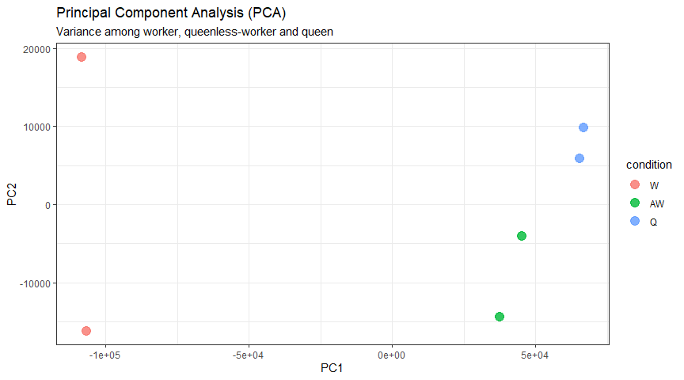

   

  

# Luiz Carlos Vieira
 *A Biologist* seeking to improve your knowledge in biology throughout by bioinformatics 

Graduated in Biological Sciences and Master in Sciences from the Department of Cellular and Molecular Biology and Pathogenic Bioagents.
I Worked as a Laboratory Technician (Trainne) and Researcher (Master's Student) at the Virology Research Center (USP).
Most recently, worked as a Laboratory Analyst in the biological quality control, performing quality control tests on viral vaccines.
Nowaday days, works as an independent biological data analyst/bioinformatician.

**Background in:** Cell and molecular Biology, Virology, Python, R, linux, data analysis.

**Links:**
* [LinkedIn](https://www.linkedin.com/in/luiz-carlos-vieira-4582797b/)

## Transcript-level differential expression

If we are interested in looking at splice isoform expression changes between groups, methods like DESeq2 are not recommended. 
Since it is more appropriate for gene differential expression. 
Therefore other methods can be used to quantify and identify transcript-level differential expression.  

Here I will describe two different pipelines:  

* [Hisat2-stringtie](https://github.com/ziul-bio/transcriptome_analysis/blob/main/1.1_hisat2-stringtie-ballgown.md)-[ballgown](https://github.com/ziul-bio/transcriptome_analysis/blob/main/1.2_ballgown.md)  

Used for assembly of transcripts, quantification of gene/transcripts expression levels and differential expression analysis.  

* [kallisto](https://github.com/ziul-bio/transcriptome_analysis/blob/main/2.1_kallisto_sleuth.md)-[sleuth](https://github.com/ziul-bio/transcriptome_analysis/blob/main/2.2_sleuth.md)  

Kallisto is a method for quantification on the transcript (isoform) level, rather than the gene level. Kallisto quantifies a set of FASTA sequences, like a transcript representative genome. Thus it does not perform transcript assembly and it cannot quantify the expression of novel transcripts.  

Kallisto can be run in “bootstrap” mode to get uncertainty estimates for the expression levels - a kind of error bar for the quantification process. 
These bootstrap results are used downstream by sleuth to perform differential expression analysis of isoforms.  

## Objectives

* Quantification of the expression levels of transcripts.  

* Calculation of the differences in expression for all transcripts among the different experimental conditions.  

Feel free to use all and share some contribuition to improve them too.
---